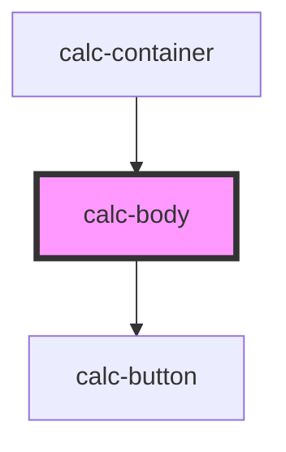

# calc-body

<!-- Auto Generated Below -->

## Events

| Event            | Description | Type                    |
| ---------------- | ----------- | ----------------------- |
| `historyChanged` |             | `CustomEvent<string[]>` |

## Dependencies

### Used by

 - [calc-container](../calc-container)

### Depends on

- [calc-button](../calc-button)

### Graph

----------------------------------------------

*Built with [StencilJS](https://stenciljs.com/)*
