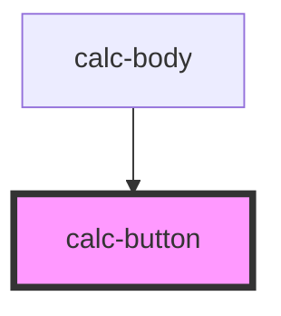

# calc-button

<!-- Auto Generated Below -->

## Properties

| Property | Attribute | Description | Type      | Default     |
| -------- | --------- | ----------- | --------- | ----------- |
| `data`   | `data`    |             | `string`  | `undefined` |
| `equal`  | `equal`   |             | `boolean` | `undefined` |
| `erase`  | `erase`   |             | `boolean` | `undefined` |

## Dependencies

### Used by

 - [calc-body](../calc-body)

### Graph

----------------------------------------------

*Built with [StencilJS](https://stenciljs.com/)*
