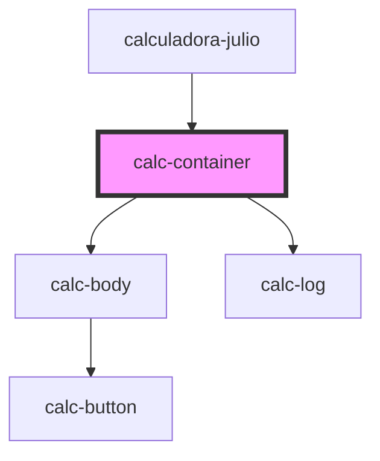

# calc-container

<!-- Auto Generated Below -->

## Dependencies

### Used by

 - [calculadora-julio](../calculadora-julio)

### Depends on

- [calc-body](../calc-body)
- [calc-log](../calc-log)

### Graph

----------------------------------------------

*Built with [StencilJS](https://stenciljs.com/)*
