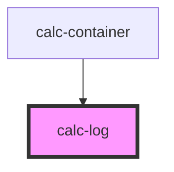

# calc-log

<!-- Auto Generated Below -->

## Properties

| Property  | Attribute | Description | Type       | Default     |
| --------- | --------- | ----------- | ---------- | ----------- |
| `history` | `history` |             | `string[]` | `undefined` |

## Dependencies

### Used by

 - [calc-container](../calc-container)

### Graph

----------------------------------------------

*Built with [StencilJS](https://stenciljs.com/)*
