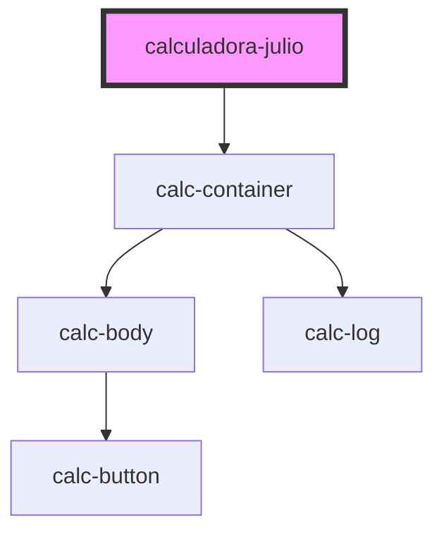

# calculadora-julio

<!-- Auto Generated Below -->

## Dependencies

### Depends on

- [calc-container](../calc-container)

### Graph

----------------------------------------------

*Built with [StencilJS](https://stenciljs.com/)*
